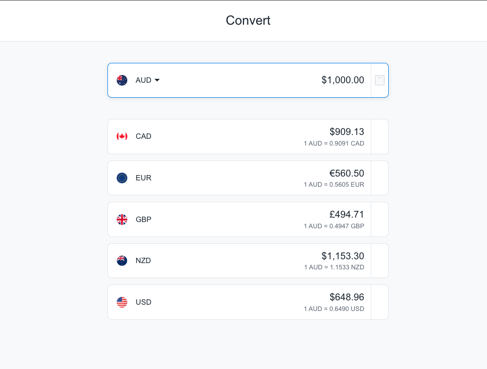
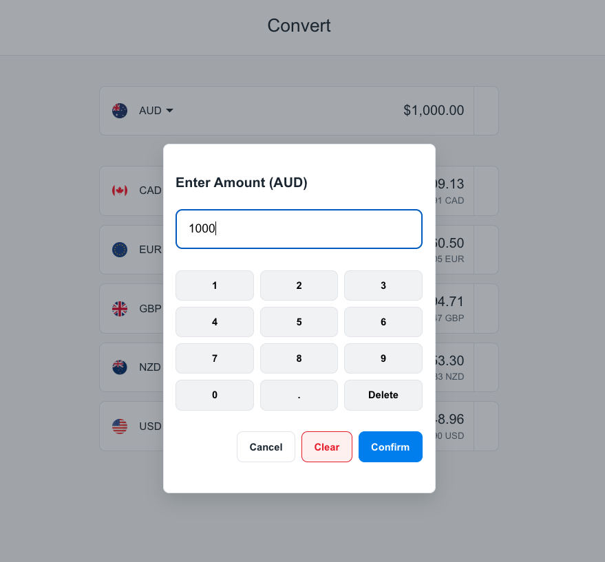
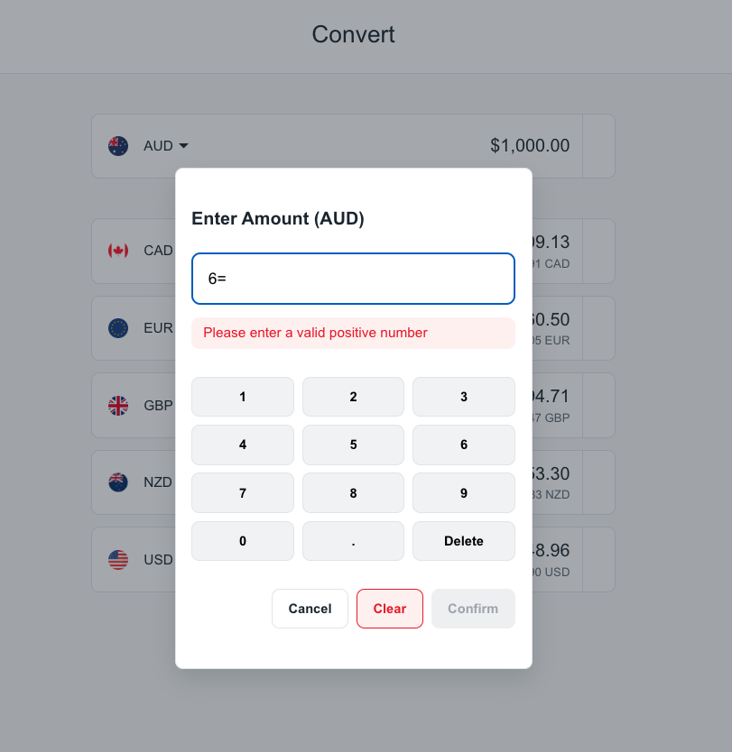
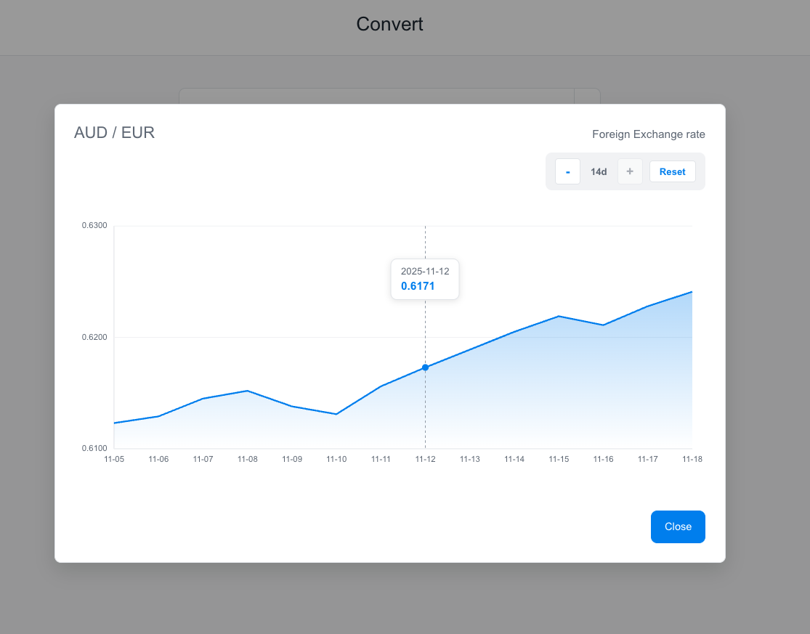
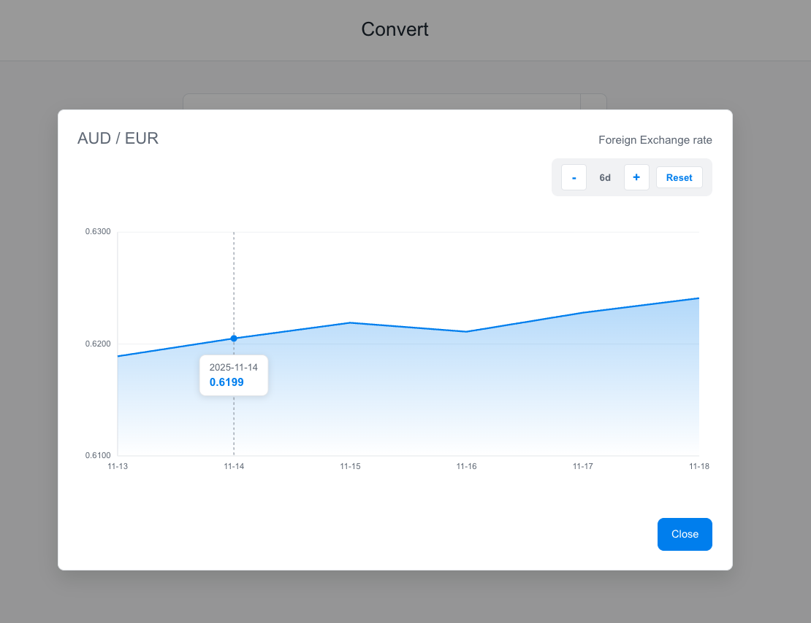
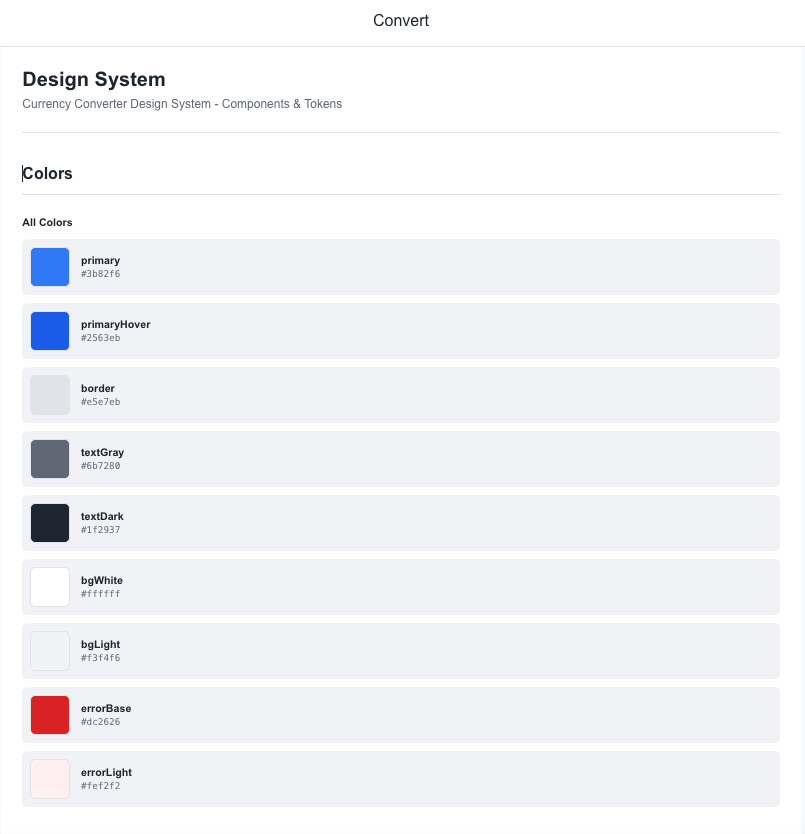
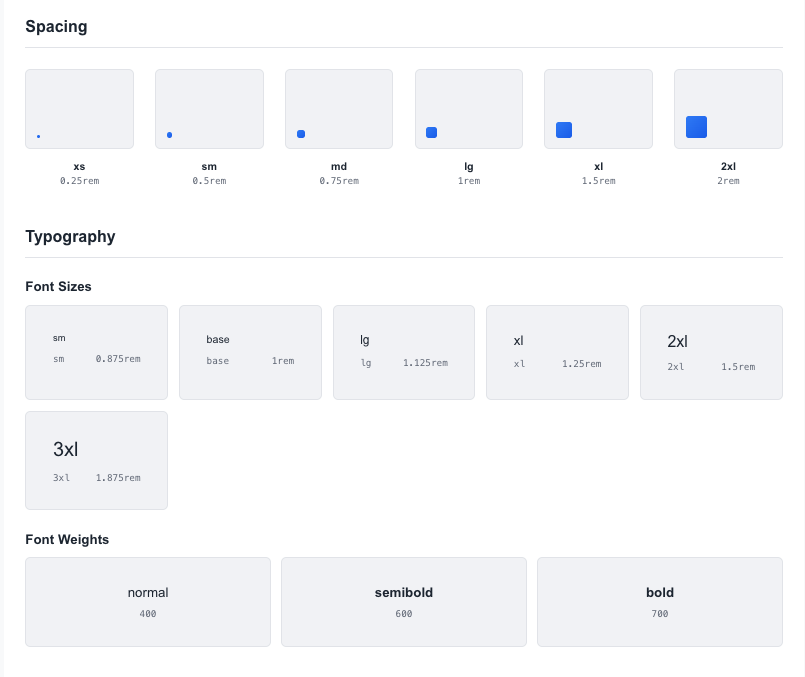
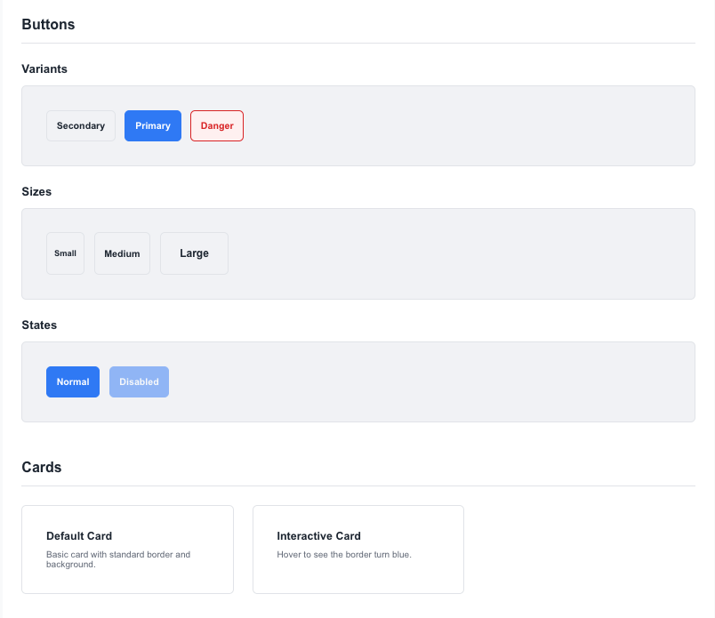
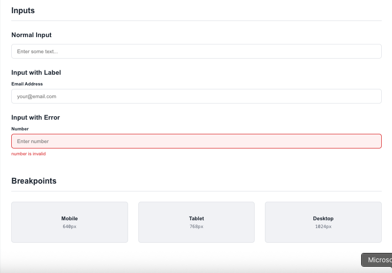

# Currency Converter Web App

A responsive web application to convert AUD to 5 predefined currencies (USD, EUR, GBP, CAD, NZD), with 14-day historical exchange rate charts.

This project is bootstrapped with [Next.js](https://nextjs.org/) using `create-next-app`.

---

## Features

- Convert AUD to 5 pre-defined currencies (USD, EUR, GBP, CAD, NZD)
- Live update as user changes the amount
- Click on a currency to see its 14-day historical exchange rate chart (bonus)
- Responsive layout for desktop and mobile
- API integration with [OpenExchangeRates.org](https://docs.openexchangerates.org/)
- Error handling for API failures and invalid input
- Development tools: TypeScript, SCSS, ESLint 9, Prettier, Husky, lint-staged
- Unit tests for core utilities and components

---

## Tech Stack

- **Frontend:** Next.js 14, React 18, TypeScript
- **Styling:** SCSS
- **API:** OpenExchangeRates.org
- **State Management:** React Hooks (`useState`, `useEffect`)
- **Dev Tools:** ESLint 9 (Flat Config), Prettier, Husky, lint-staged, Jest & Testing Library
- **Charting:** Built-in charts for historical exchange rates
- **Containerization:** Docker (production-ready multi-stage build)

---

## Getting Started

### Prerequisites

- **Node.js:** 18.17.0 or higher
- **npm:** 9.0.0 or higher

### Installation

Install dependencies:

```bash
npm install
```

### Environment Variables

Create a `.env.local` file in the root directory:

```env
NEXT_PUBLIC_EXCHANGE_API_KEY=your_openexchangerates_api_key
```

Get your API key from [OpenExchangeRates.org](https://openexchangerates.org/).

### Development

Run the development server:

```bash
npm run dev
```

Open [http://localhost:3000](http://localhost:3000) with your browser to see the result.

You can start editing the page by modifying `app/page.tsx`. The page auto-updates as you edit the file.

This project uses [`next/font`](https://nextjs.org/docs/basic-features/font-optimization) to automatically optimize and load Inter, a custom Google Font.

---

## Available Scripts

### Development

Start the development server:

```bash
npm run dev
```

### Build for Production

```bash
npm run build
```

### Start Production Server

```bash
npm start
```

### Code Formatting

Format code with Prettier:

```bash
npm run prettier:fix
```

Check formatting without changes:

```bash
npm run prettier
```

**In VS Code:** Press `Shift + Alt + F` to format, or enable "Format On Save" in settings.

### Linting

Run ESLint (with flat config):

```bash
npm run lint
```

Fix auto-fixable issues:

```bash
npm run lint -- --fix
```

### Testing

Run all tests:

```bash
npm run test
```

Run tests in watch mode:

```bash
npm run test -- --watch
```

Run tests with coverage:

```bash
npm run coverage
```

---

## Code Quality Tools

This project uses modern code quality tools:

- **ESLint 9** - Latest version with flat config format (`eslint.config.mjs`)
- **Prettier** - Code formatting
- **Husky** - Git hooks
- **lint-staged** - Run linters on staged files before commit
- **TypeScript** - Type checking

### Pre-commit Hooks

Husky automatically runs the following checks before each commit:

- ESLint on staged files
- Prettier formatting
- TypeScript type checking

---

## Docker

### Build Docker Image

```bash
docker build -t currency-converter .
```

### Run Docker Container

```bash
docker run -p 3000:3000 currency-converter
```

The application will be available at [http://localhost:3000](http://localhost:3000).

---

## Project Structure

```
currency-converter/
├── app/                     # Next.js app directory
│   ├── page.tsx            # Main page
│   └── layout.tsx          # Root layout
├── components/              # React components
│   ├── CurrencyConverter/  # Main converter component
│   └── ...                 # Other components
├── public/                  # Static assets
├── styles/                  # SCSS stylesheets
├── utils/                   # Utility functions
├── __tests__/              # Test files
├── .env.local              # Environment variables (create this)
├── .gitignore              # Git ignore rules
├── Dockerfile              # Docker configuration
├── eslint.config.mjs       # ESLint 9 flat config
├── jest.config.js          # Jest configuration
├── next.config.js          # Next.js configuration
├── package.json            # Dependencies and scripts
├── tsconfig.json           # TypeScript configuration
└── README.md              # This file
```

---

## API Integration

This app uses the [OpenExchangeRates API](https://docs.openexchangerates.org/) to fetch:

- Latest exchange rates
- Historical exchange rates (14-day period)

**Note:** Free tier has rate limits (1,000 requests/month). Consider upgrading for production use.

---

## Troubleshooting

### Node.js Version Issues

If you see engine warnings, upgrade Node.js:

```bash
# Using nvm (recommended)
nvm install 18
nvm use 18
nvm alias default 18

# Verify version
node -v  # Should be 18.17.0 or higher
npm -v   # Should be 9.0.0 or higher
```

### Security Vulnerabilities

Fix security issues:

```bash
npm audit fix
```

For issues requiring breaking changes:

```bash
npm audit fix --force
```

### Git Hooks Not Working

Reinstall Husky:

```bash
git init
npx husky install
```

---

## Contributing

Contributions are welcome! Please follow these steps:

1. Fork the repository
2. Create a feature branch (`git checkout -b feature/amazing-feature`)
3. Commit your changes (`git commit -m 'Add amazing feature'`)
4. Push to the branch (`git push origin feature/amazing-feature`)
5. Open a Pull Request

### Coding Standards

- Follow ESLint rules (enforced by pre-commit hooks)
- Write unit tests for new features
- Maintain TypeScript strict mode
- Document complex logic with comments

---

## License

This project is open source and available under the [MIT License](LICENSE).

---

## Demo / Screenshots

<!-- Replace with actual screenshots -->












---

## Learn More

To learn more about the technologies used in this project:

- [Next.js Documentation](https://nextjs.org/docs) - Learn about Next.js features and API
- [React Documentation](https://react.dev/) - Learn React
- [TypeScript Documentation](https://www.typescriptlang.org/docs/) - Learn TypeScript
- [ESLint Documentation](https://eslint.org/docs/latest/) - Learn about ESLint 9
- [Jest Documentation](https://jestjs.io/docs/getting-started) - Learn testing with Jest

You can check out [the Next.js GitHub repository](https://github.com/vercel/next.js/) - your feedback and contributions are welcome!

---

## Deploy on Vercel

The easiest way to deploy your Next.js app is to use the [Vercel Platform](https://vercel.com/new?utm_medium=default-template&filter=next.js&utm_source=create-next-app&utm_campaign=create-next-app-readme) from the creators of Next.js.

### Deploy Steps

1. Push your code to GitHub
2. Import your repository to Vercel
3. Add environment variables in Vercel dashboard:
   - `NEXT_PUBLIC_EXCHANGE_API_KEY`
4. Deploy!

Check out the [Next.js deployment documentation](https://nextjs.org/docs/deployment) for more details.
